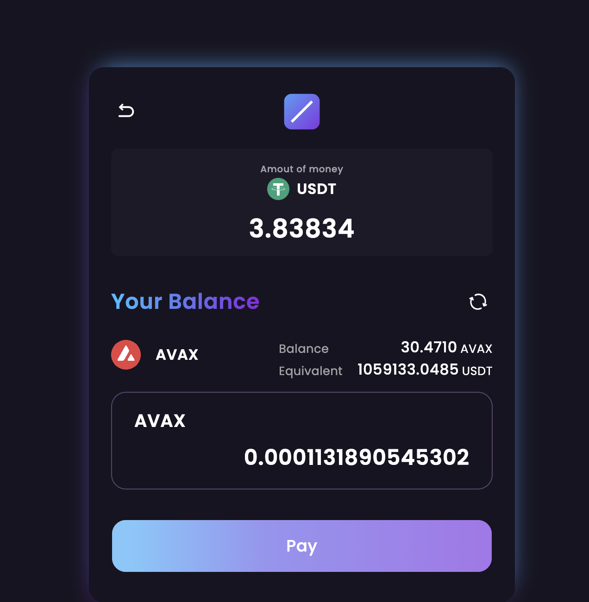
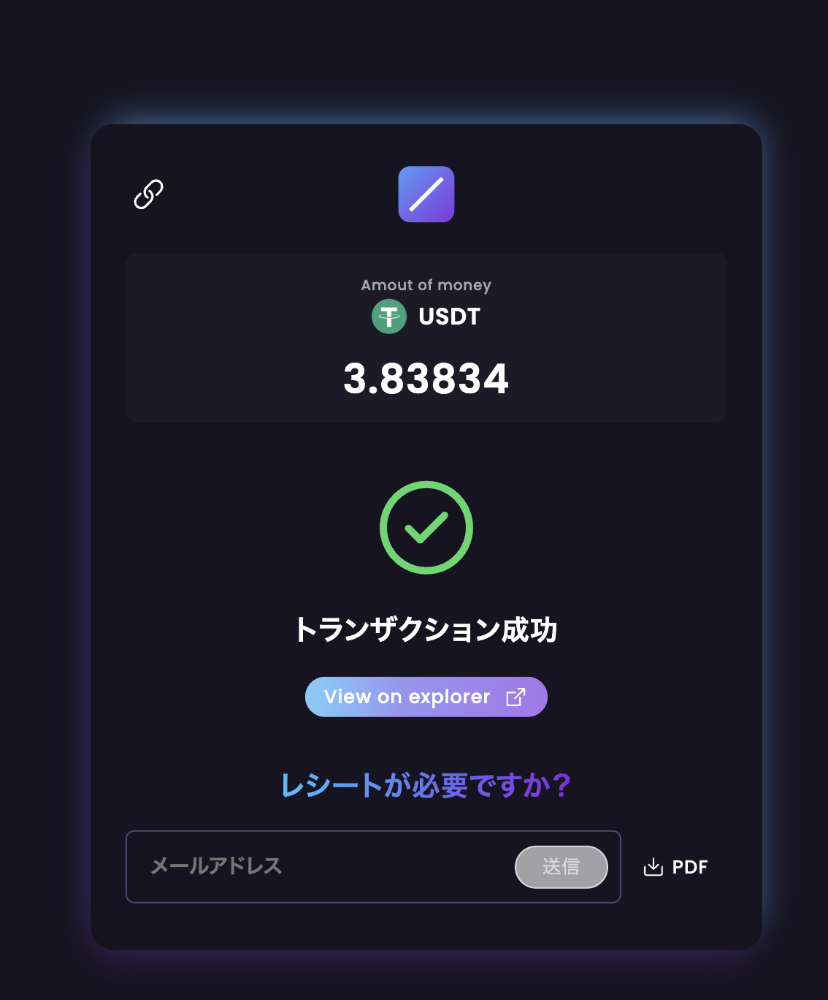
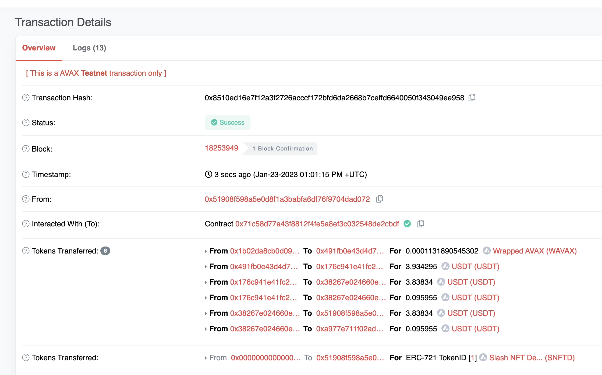

# Slash Extension NFT Minting

1. NFT をデプロイする。

```bash
npm run deploy:nft:fuji
```

result

```bash
Deploying 'ERC721Demo'
   ----------------------
   > transaction hash:    0x0a99592dbcfb14034bb440e25b4e4d0174a5389fa05c30e3a66b8fb76146daab
   > Blocks: 0            Seconds: 0
   > contract address:    0xA0B912d2797602863ce04F370b36330d80e76832
```

2. MintExtension コントラクトをデプロイする。

```bash
npm run deploy:ex:fuji
```

result

```bash
 Deploying 'MintExtension'
   -------------------------
   > transaction hash:    0x430ddb7ce1d8ca0b57f16b7abf93ba8abd02a548f23b53b2577d4aba2166c209
   > Blocks: 0            Seconds: 0
   > contract address:    0x56Ce163A1909eC0c6F363FfdB71e781d56D41505
```

3. MintExtension コントラクトを Verify する。

```bash
npm run verify:ex:fuji
```

result

[https://testnet.snowtrace.io/address/0x56Ce163A1909eC0c6F363FfdB71e781d56D41505#code](https://testnet.snowtrace.io/address/0x56Ce163A1909eC0c6F363FfdB71e781d56D41505#code)

4. slash 側の設定で、受信アドレスを変更する。


5. slash で決済する。


決済前は NFT は、0







実際の決済トランザクションは下記の通り。  
トークンの移転後に NFT が移転されているのがわかる！

[https://testnet.snowtrace.io/tx/0x8510ed16e7f12a3f2726acccf172bfd6da2668b7ceffd6640050f343049ee958](https://testnet.snowtrace.io/tx/0x8510ed16e7f12a3f2726acccf172bfd6da2668b7ceffd6640050f343049ee958)



## optional パラメータの中身を確認するためのコントラクト

- [NFT Contract](https://testnet.snowtrace.io/address/0xCf92cf20D258C993B4cea4f6fAD35116Fb7211b3)
- [Extention Contract](https://testnet.snowtrace.io/address/0x661FeB49c34995715cb94e698fACabC535CD934E)
